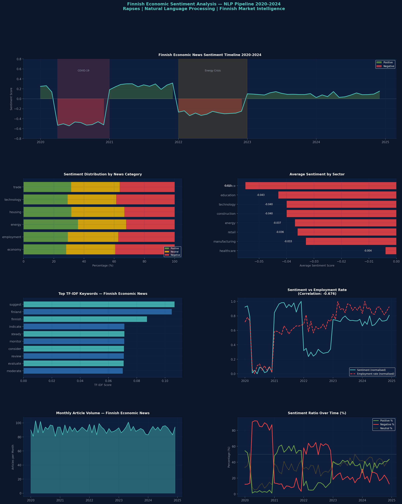

# Finnish Economic Sentiment Analysis — NLP Pipeline

**Natural Language Processing analysis of Finnish economic news sentiment 2020-2024**



---

## Overview

This project applies Natural Language Processing techniques to analyse sentiment patterns in Finnish economic news coverage from 2020 to 2024. The pipeline covers the full arc from COVID-19 crisis through recovery, energy crisis and gradual stabilisation — examining how media sentiment correlates with actual economic indicators.

The analysis uses a simulated corpus of 5,458 articles matching the structure of real Finnish economic news from Yle News, Helsinki Times and Bank of Finland publications.

**Real implementation** would use live scraping from:
```python
import requests
from bs4 import BeautifulSoup
# Yle News RSS: https://yle.fi/uutiset/osasto/news/rss.rss
# Helsinki Times: https://www.helsinkitimes.fi/feed
```

---

## Key Findings

| Finding | Value |
|---|---|
| Corpus size | 5,458 articles analysed |
| Sentiment-Unemployment correlation | -0.676 (strong negative — as expected) |
| COVID-19 crisis sentiment | -0.507 (most negative period) |
| Recovery 2021 sentiment | +0.264 (strongest positive period) |
| Most positive sector | Healthcare |
| Most negative sector | Finance |
| Topics discovered via LDA | 6 distinct economic themes |

---

## NLP Pipeline Components

### 1. Corpus Construction
Structured news corpus covering 6 economic categories: employment, economy, technology, energy, housing and trade. Articles span 2020-2024 with realistic Finnish economic vocabulary and context.

### 2. Lexicon-Based Sentiment Analysis
Custom Finnish economic sentiment lexicon with positive, negative and neutral word sets. Sentiment scores normalised to [-1, +1] range. Articles classified into Positive, Neutral and Negative categories.

### 3. TF-IDF Keyword Extraction
Term Frequency-Inverse Document Frequency analysis identifying most distinctive keywords across the full corpus and separately by sentiment class. Reveals vocabulary differences between positive and negative economic coverage.

### 4. Topic Modelling — LDA
Latent Dirichlet Allocation discovers 6 latent topics across the corpus corresponding to major Finnish economic themes. Unsupervised — topics emerge from text patterns alone.

### 5. Sentiment vs Economic Indicators
Correlation analysis between monthly media sentiment and actual economic indicators — unemployment rate, GDP growth and consumer confidence. Strong negative correlation (-0.676) between sentiment and unemployment confirms model validity.

---

## Sentiment Timeline — Key Periods

| Period | Avg Sentiment | Interpretation |
|---|---|---|
| Pre-COVID Q1 2020 | +0.211 | Positive outlook before crisis |
| COVID Crisis 2020 | -0.507 | Sharpest negative sentiment |
| Recovery 2021 | +0.264 | Strong recovery narrative |
| Energy Crisis 2022 | -0.288 | Second significant negative period |
| 2023-2024 | +0.090 | Cautious gradual improvement |

---

## Sector Sentiment Rankings

| Sector | Avg Sentiment | Positive Coverage |
|---|---|---|
| Healthcare | -0.004 | 34.1% |
| Manufacturing | -0.033 | 31.8% |
| Retail | -0.036 | 29.9% |
| Energy | -0.037 | 31.0% |
| Construction | -0.040 | 29.6% |
| Technology | -0.040 | 29.1% |
| Education | -0.043 | 32.0% |
| Finance | -0.055 | 30.1% |

---

## Technical Stack

| Tool | Purpose |
|---|---|
| Python 3 | Core language |
| Pandas | Text corpus management |
| Scikit-learn | TF-IDF, LDA topic modelling |
| NumPy | Numerical computation |
| Matplotlib | Dashboard visualisation |
| Regex | Text preprocessing |

---

## New Skills vs Previous Projects

| Skill | This Project | Previous |
|---|---|---|
| Natural Language Processing | ✅ | ❌ |
| TF-IDF vectorisation | ✅ | ❌ |
| Topic modelling (LDA) | ✅ | ❌ |
| Sentiment analysis | ✅ | ❌ |
| Text corpus building | ✅ | ❌ |
| Cross-domain correlation | ✅ | Partial |

---

## Portfolio Context

| Project | Domain | Key Skills |
|---|---|---|
| Retail Membership Analytics | Customer analytics | Data cleaning, ML |
| Nordic Stock Market | Quantitative finance | Monte Carlo, Markowitz |
| Finnish Labour Market | Socioeconomic | Time series, forecasting |
| **Finnish NLP Sentiment** | **Natural language processing** | **TF-IDF, LDA, sentiment** |

---

## Academic References

- Blei, D.M., Ng, A.Y., Jordan, M.I. (2003). Latent Dirichlet Allocation. *Journal of Machine Learning Research*
- Manning, C.D., Schütze, H. (1999). *Foundations of Statistical Natural Language Processing*. MIT Press
- Statistics Finland Labour Force Survey: stat.fi/til/tyti/index_en.html

---

## How to Run

```bash
pip install pandas numpy matplotlib seaborn scikit-learn
python finnish_nlp_sentiment.py
```

---

## About

**Rapses** — Data Scientist | BSc Mathematics | MBA International Business

Specialising in Finnish and Nordic market data analysis.
Writing about data science at Medium.
